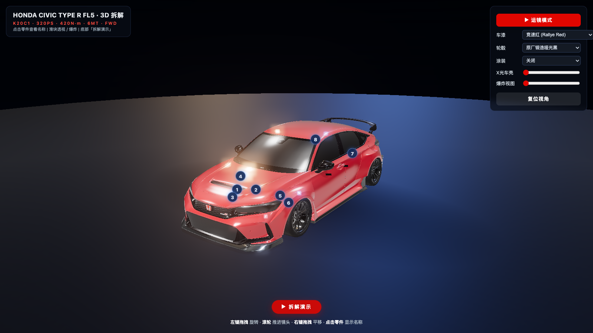
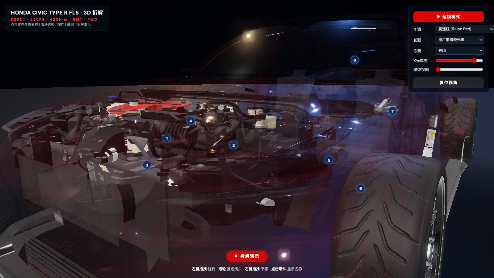
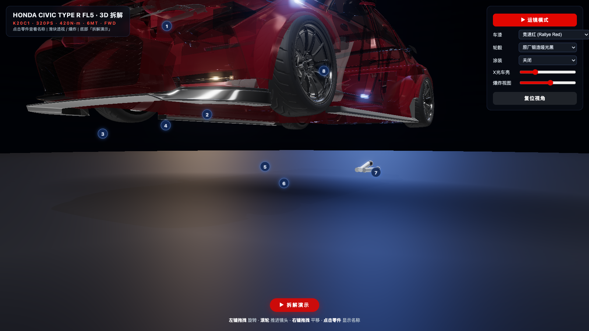
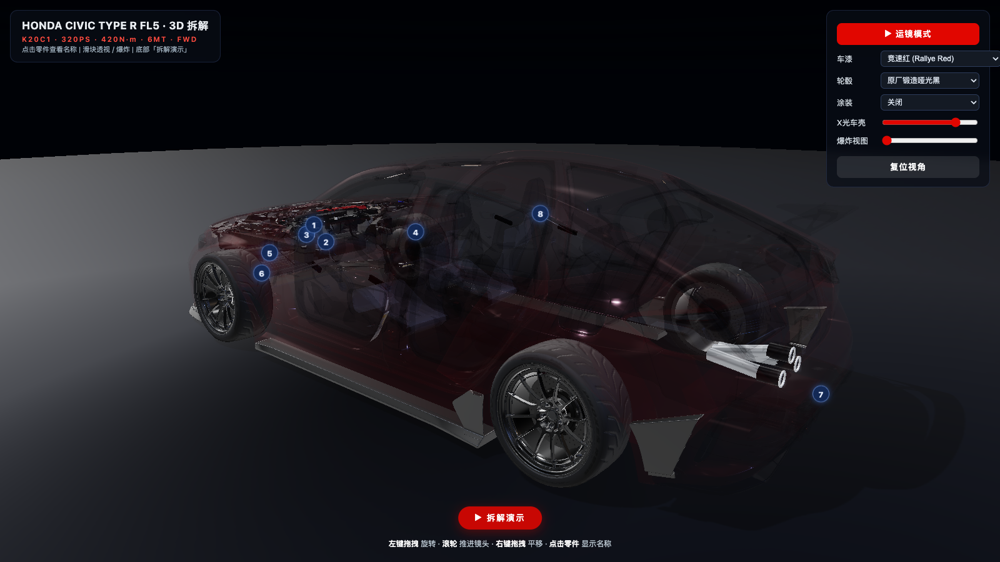

# Honda Civic Type R FL5 · 3D Cutaway Model

An interactive, fully procedural 3D cutaway model of the Honda Civic Type R (FL5) built with **Three.js** — no external 3D model files, every mesh generated in code.






## Features

- **Full cutaway anatomy**: K20C1 2.0T engine (red valve cover, intake manifold, turbo, intercooler), 6MT transaxle, half shafts, MacPherson front + multilink rear suspension, Brembo calipers, exhaust with blue heat-shielded header → high-flow cat → triple center-exit tips, radiator, fuel tank, battery, interior (Recaro-style seats, flat-bottom wheel, dash)
- **Sculpted body**: extruded side profile with vertex-sculpted tumblehome, plan taper, wheel-arch muscle bulges; fastback hatch silhouette; Championship White clearcoat paint
- **X-Ray slider**: fade body shell opacity 1→0.05 to reveal internals; BiW framework fades in
- **Explode view**: engine lifts, wheels push out, exhaust drops — all systems separate by direction
- **Cinematic tour**: 8-station auto-flythrough (exterior orbit → dive into engine bay → turbo closeup → follow exhaust to tail → chassis → return) with HUD station names
- **Click any part**: raycaster picks labeled meshes, shows Chinese name tooltip that follows the part
- **Intro camera glide**: 3-second eased entrance on load; auto-rotate until user interacts

## Run Locally

```bash
node serve.js
# open http://localhost:8790
```

No build step, no npm install. Three.js loads via CDN importmap (unpkg).

## Online (GitHub Pages)

No build step needed — the repo root is the site. Once GitHub Pages is enabled on `main` (/), the model is live at:

**https://liooo0.github.io/lio-fl5-3d/**

Note: Three.js loads from the unpkg CDN, so an internet connection is required even for the Pages deployment.

## Tech Notes

- Three.js r160 (ES Modules + importmap)
- Pure procedural geometry: ExtrudeGeometry, CylinderGeometry, TorusGeometry, TubeGeometry, CatmullRomCurve3 — zero model files
- MeshPhysicalMaterial clearcoat for paint; RoomEnvironment PMREM for reflections
- ~38k triangles, PCFSoft shadows (2048 map), ACES tone mapping
- rAF loop wrapped in try/catch with `window.__fl5` test interface

## Liveries

The abstract livery styles (N4 / N3 / N1) are procedurally generated. The two character itasha liveries (霞之丘诗羽 / Utaha Kasumigaoka from *Saenai Heroine no Sodatekata*, 樱岛麻衣 / Mai Sakurajima from *Seishun Buta Yarou*) are **user-made fan art projections, non-commercial display only**. All character rights belong to their respective original copyright holders (FNx A-1 Pictures / Kadokawa; CloverWorks / Kadokawa). Honda and Type R remain trademarks of Honda Motor Co.

## License

Code distributed under the [MIT License](LICENSE).

### 3D Model Attribution (CC BY-NC-ND 4.0)

The realistic exterior shell used in v3.0+ is based on ["Honda Civic Type R FL5 Custom"](https://sketchfab.com/3d-models/honda-civic-type-r-fl5-custom-407a8981be2d45a388d7280d9b931663) by **blakebella** on Sketchfab, licensed under [CC BY-NC-ND 4.0](https://creativecommons.org/licenses/by-nc-nd/4.0/). The shell file itself (`models/*.glb`) is **not** redistributed in this repository, per the ND clause.

- **BY** — blakebella is credited here and in the in-app "About" panel.
- **NC** — this project is and remains non-commercial. Commercial use of the shell model is not permitted.
- **ND** — only the unmodified original GLB is redistributed (runtime paint/grouping changes are code-side, the file itself is untouched); modified versions of the mesh are not distributed.
- Internal mechanical components (engine, turbo, transmission, suspension, exhaust) remain original procedural geometry from this project, MIT licensed.
- The shell GLB ships with the repository so the realistic body works out-of-the-box on GitHub Pages.

## Disclaimer

This is an unofficial, non-commercial fan project. It is not affiliated with, sponsored, or endorsed by Honda Motor Co., Ltd. Honda, Civic, and Type R are trademarks of Honda Motor Co., Ltd. The FL5 shell mesh by blakebella is a fan-made replica; all mechanical internals are original procedural approximations built for illustration purposes.

## Verification

See [VERIFICATION.md](VERIFICATION.md) for full automated Playwright verification results (console errors, WebGL check, screenshots, feature probes).
