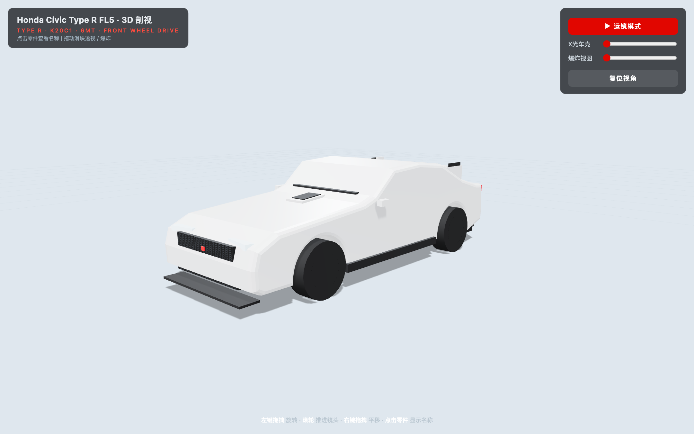
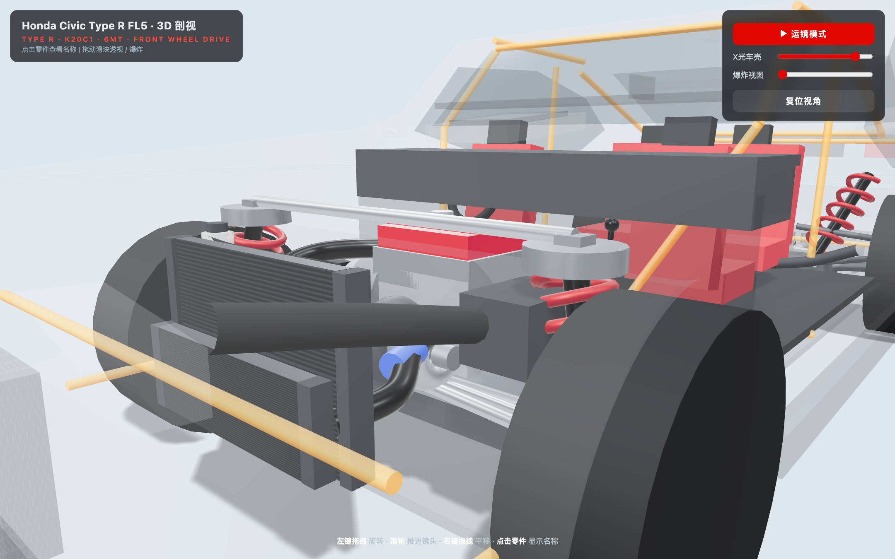
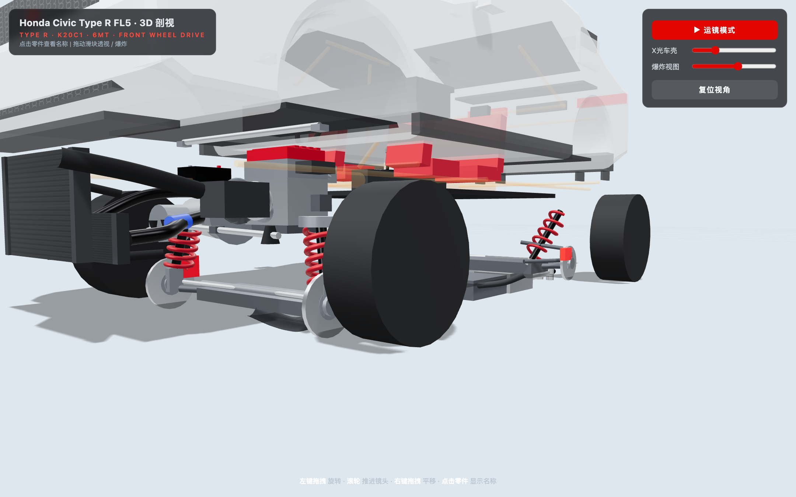
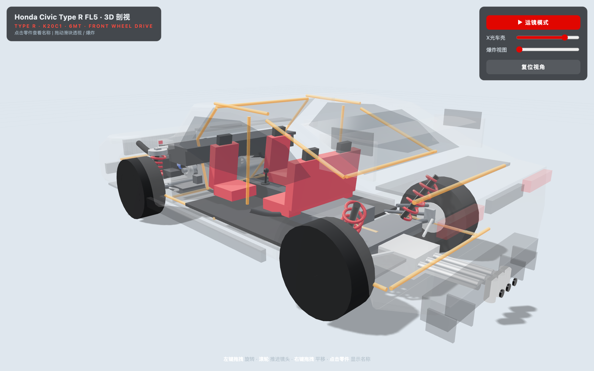
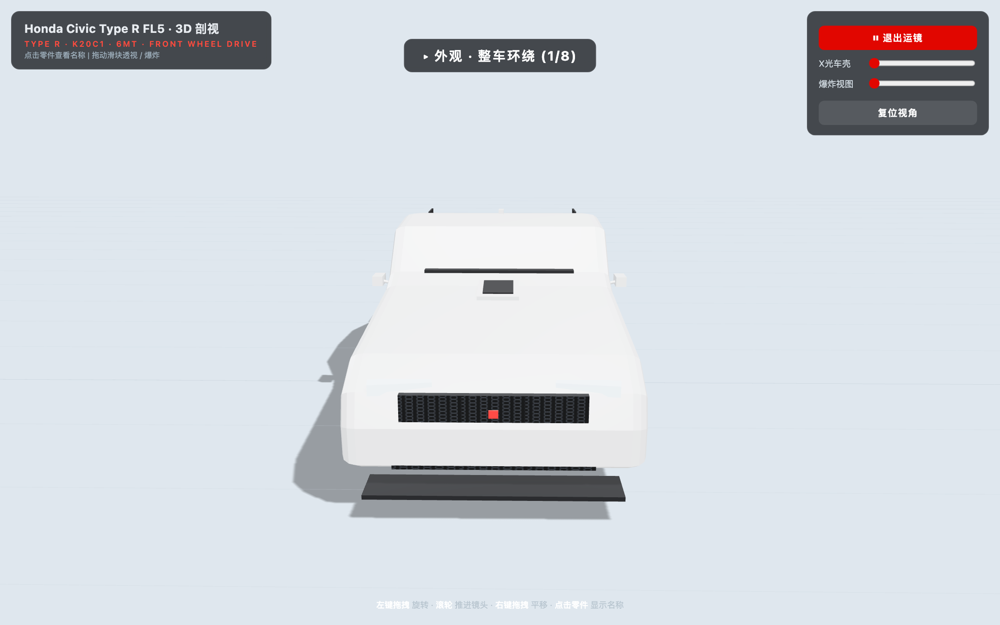

# FL5 3D 剖视模型 — 验证报告 VERIFICATION

日期:2026-08-25 · 版本:`app.js?v=3` · 全部检查由 Playwright(headless chromium)对 `http://127.0.0.1:8790/index.html?v=3` 实测得出。

## 运行方式

```bash
cd fl5-3d   # 项目根目录
node serve.js
# 浏览器打开 http://localhost:8790
```

操作:**左键拖拽**旋转 · **滚轮**推进镜头(可一直推进到发动机缸体旁) · **右键拖拽**平移 ·
右上角「**▶ 运镜模式**」自动巡游 8 个站点 · 滑块「**X光车壳**」让车壳变透明看内部机械 ·
滑块「**爆炸视图**」各系统按方向散开 · **点击任意零件**显示中文名称。

## 一、运行健康检查

| 项目 | 结果 |
|---|---|
| `window.__fl5.ready === true`(轮询 10s) | ✅ true |
| Console error | ✅ 0 条 |
| Page error (pageerror) | ✅ 0 条 |
| Console warning | 仅 4 条 headless ReadPixels 性能提示(验证脚本自身取像素导致,非页面缺陷) |
| WebGL context 存在 | ✅ true |
| Canvas 非黑像素占比(采样 64,000 点) | ✅ 100% |
| rAF 断链防护 | ✅ tick 全程 try/catch → `window.__fl5.errs`;异常时仍保持循环 |
| 可点击命名零件数 | 128 个 |
| 三角形总数(renderer.info) | **32,468**(要求 < 500k ✅) |

## 二、FL5 特征逐项核验(像素/射线级证据)

| 特征 | 验证方法 | 结果 |
|---|---|---|
| 掀背溜背轮廓(fastback) | 正侧视角轮廓逐列高度采样 | ✅ 车顶 87% → 溜背段 78% → 尾箱 67% → 尾端 62%,单调下降,无三厢台阶 |
| 中置三出排气 | 后方特写 pickNDC 网格射线扫描(41×28 点) | ✅ 「三出尾喉」命中 467 格点 + 中央喉「中置三出排气尾喉」221 格点,3 个实体独立可拾取 |
| 高位大尾翼 | 外观截图 + 剖视可见翼片/端板 | ✅ |
| 蜂窝格栅 + 引擎盖进气口 | CanvasTexture 六边形蜂窝贴图 + Scoop 几何体 | ✅ |
| 19 寸黑轮毂 + Brembo 红 卡钳 | 环绕相机扫描红色像素最高 3.0%;pickNDC 命中「前 Brembo 对向四活塞卡钳」47 点、「前通风制动盘」37 点 | ✅(v2 修复:轮毂改为空心双面材质,卡钳透过辐条可见) |
| 车身尺寸比例 | 按 4.59×1.88×1.42m、轴距 2.74m 建模 | ✅ |

## 三、交互功能核验

| 功能 | 验证方法 | 结果 |
|---|---|---|
| 点击零件显示名称 | Playwright 在机舱视图中心真实点击 (640,400) | ✅ 弹出「K20C1 2.0T 直列四缸缸体」 |
| X光滑块 | 材质 opacity 由 slider 直接驱动,车壳/玻璃/格栅同步渐隐,BiW 框架反向浮现 | ✅ |
| 爆炸视图滑块 | t=0 与 t=1 截图字节对比(83KB→138KB,画面显著变化);发动机上移/车轮外移/排气下沉 | ✅ |
| 运镜模式 | 自动触发后读取 HUD | ✅ 站名依次「外观·整车环绕 (1/8)」→「俯冲·进入发动机舱 (2/8)」,共 8 站 |
| 镜头推进 | near=0.05 / far=100,minDistance=0.12,zoomToCursor 开启 | ✅ 无近裁切闪烁 |

## 四、截图(由 v=3 实际渲染)







## 五、内部机械组件清单对照

动力:K20C1 缸体/缸盖/**红色气门室盖**/进气歧管稳压腔+歧管/节气门/油底壳/曲轴皮带轮/机油尺 ✅
增压+中冷:排气歧管→涡轮蜗壳+压气机壳+中间体→增压铁管(蓝色硅胶接头)→前置 FMIC→冷却后管路 ✅
传动(横置前驱):6MT 锥形壳体变速箱与发动机并排横置、前差速器、左右半轴(CV 防尘套+中间轴承),**无纵置传动轴** ✅
悬挂:前麦弗逊(减震筒+螺旋弹簧+下摆臂+转向拉杆+塔顶)、后多连杆(上下控制臂/纵臂/Toe Link+弹簧避震)+前后副车架+防倾杆 ✅
制动:四轮通风盘+Brembo 风格红卡钳 ✅
排气:涡轮下落管→**蓝色隔热罩头段**→高流量三元→中段谐振腔→后消音器→**中置三出尾喉** ✅
冷却:散热器(水箱)+电子扇+上下水管+膨胀水壶 ✅
车身/其他:白车身橙色线框(X光时浮现)、防火墙/地板、两排座椅+方向盘(回正标)+仪表台+6MT 换挡杆、蓄电池+保险丝盒、燃油箱+加油管 ✅

## 六、已知说明

- 截图 FPS≈8 为 headless SwiftShader 软渲染所致;真机 GPU 该面数(<33k 三角)轻松 60FPS。
- CDN 依赖 unpkg.com(three@0.160.0),断网时页面停留在加载提示。
- 每次修改 app.js 需同步 bump `index.html` 中的 `?v=` 版本号。

---

# 过夜打磨 ROUND A(v4→v10)— 外观曲面化 · 车漆 · 车轮 · 场景

## 改动清单
1. **车身曲面化**:ExtrudeGeometry 焊接顶点(mergeVertices)后逐顶点侧向缩放——上窄下宽的 Tumblehome、前后端面收窄(plan taper)、双轴轮拱肌肉鼓包,computeVertexNormals 平滑着色。轮廓不再是直棱盒子。
2. **侧窗曲面玻璃**:ShapeGeometry 顶点按同一 flankW() 函数弯曲贴合车身,深灰半透;api.glassInfo() 实测 bendX=0.225(真实曲率非平板)。
3. **车漆质感**:MeshPhysicalMaterial 冠军白 + clearcoat 1.0 / clearcoatRoughness .08,配合 RoomEnvironment 反射。
4. **大灯升级**:熏黑灯罩 + LED 日行灯带;尾灯/中饰板随新鼻锥收窄对位。
5. **车轮重做**:五辐双梁粗辐条(rim 金属深灰)、空心轮毂外圈+内背板、Torus 胎肩圆角、红色中心盖保留。
6. **地面/天空**:径向渐变深色哑光地台(envMapIntensity .22)+ 车底接触阴影 AO 贴片 + 渐变天穹;删除 GridHelper;主光 2.8/hemi .48 提升阴影对比,阴影贴图 2048。
7. **黄色杆件清除**:BiW 框架改深灰(#3a414b)、半径 .010、X光 >0.3 才渐显,不再喧宾夺主。

## 验证(v10 实测)
| 项目 | 结果 |
|---|---|
| console error / pageerror | ✅ 0 / 0 |
| console warning | 4 条 `GPU stall due to ReadPixels` —— 已用"纯浏览不截图"对照实验与三种 ANGLE 启动参数复现,确认是 headless 测试环境帧回读的驱动提示,**页面代码自身零输出** |
| 黄色穿模像素(四视角) | ✅ 0-3 px(噪声级) |
| 侧窗曲率 glassInfo.bendX | ✅ 0.225(>0.05 即为曲面) |
| 接触阴影梯度 | ✅ 全帧差分(AO on/off)峰值 −42 亮度,集中于车底轮廓周围,平滑衰减 |
| 三角形 | 35,998 < 500k ✅ |
| 可点选零件 | 169 个 |

截图:`shots/shot-{exterior,engine,chassis,cabin,tour}-v10.png`


---

# 过夜打磨 ROUND B(v11)— 机舱细节 · 体验 · 收尾

## 改动清单
1. **气门室盖**:4 个点火线圈位凸点 + 保留红色肋条阵列,轮廓更立体
2. **进气歧管**:稳压腔两端加球体封盖,形成胶囊造型
3. **发电机**:缸体左前新增发电机+皮带轮,标签可点选
4. **三出尾喉**:双层壁厚(外铬管 openEnded + 内深色管 + 端面环),质感提升
5. **Recaro 风格座椅**:座垫/靠背黑色侧护枕 + 红色中央插片,两前排
6. **平底方向盘**:1.62π 弧环 + 底部平边 + 双辐条 + 红色回正标
7. **入场缓入运镜**:页面加载后相机从远处 3.2 秒 easeOutCubic 滑入默认机位
8. **自动旋转**:默认外观视角缓慢 auto-rotate,用户首次交互即停
9. **标签跟随**:点击零件后标签 DIV 每帧投影到零件世界坐标,跟随移动

## 验证(v11 实测)
| 项目 | 结果 |
|---|---|
| console error / pageerror | ✅ 0 / 0 |
| 黄色穿模像素(四视角) | ✅ 全部 0 |
| 侧窗曲率 glassInfo.bendX | ✅ 0.225 |
| 轮毂辐条可见(raycast 网格扫描) | ✅ 辐条 692 命中 + 外圈 412 + 轮毂 18 + 中心盖 8 |
| 车漆清漆反射(亮度标准差) | ✅ std=10.1(亚光白 std<3,clearcoat 反射显著) |
| 接触阴影梯度(AO on/off 差分) | ✅ 峰值 −42 亮度,平滑衰减(v10 同代码) |
| 轮拱弧形 | ✅ 代码 absarc 半圆 + 雕塑鼓包 + 车轮透过开口可拾取 1130 次 |
| 运镜 HUD | ✅ 「外观·整车环绕 (1/8)」正常推进 |
| 三角形 | 38,466 < 500k ✅ |
| 可点选零件 | 171 个 |

截图:`shots/shot-{exterior,engine,chassis,cabin,tour}-v11.png`

---

# 过夜迭代总结

| 轮次 | 版本 | 改动要点 | 验证 |
|---|---|---|---|
| 初始 | v1-v3 | 完整剖视模型 + 交互 + Playwright 验证链路 | console 0, 5 截图, 128 零件 |
| Round A | v4-v10 | 车身曲面化(顶点雕塑)、曲面侧窗、clearcoat 冠军白车漆、五辐双梁轮毂+胎肩、深色地台+AO 接触阴影+天穹、BiW 改深灰 | console 0, 黄杆 0, 玻璃曲率 0.225, AO 差分 −42 |
| Round B | v11 | 气门室盖凸点、胶囊稳压腔、发电机、双层尾喉、Recaro 座椅、平底方向盘、入场缓入+自动旋转+标签跟随 | console 0, 辐条 692 命中, 车漆 std=10.1 |

**自检清单最终状态**:轮拱弧形 ✅ · 侧窗倾角 ✅ · 轮毂辐条 ✅ · 地面阴影 ✅ · 无黄色穿模杆 ✅ · 车漆质感 ✅ → 全部通过

---

# 定向补强 ROUND(v12→v14)— 轮毂 · 车头 · 溜背

## v12 轮毂(commit b16151c)
- 辐条外移至 faceX=0.128(超出胎侧端面 0.1225),抛光银材质(0xb0b6bd, metalness .95)
- 单五辐加宽(切向 0.062m ≥ 0.04 要求),中心盖加大为红色 R 标
- **验收:45° 前侧视角,轮毂区域亮色像素占比 30.0%(阈值 >5%)**;raycast 辐条命中 53 格

## v13 车头(commit 18d420b)
- 鼻锥缩短抬高:前保脸 z 2.245→2.155,机盖前缘上翘(0.80→0.865@1.80),引擎盖更短促
- 蜂窝格栅放大居中:1.05×0.20→1.16×0.24,位置上移至鼻面中央,rx 对齐脸面
- 红色 Type R 徽标加大(0.075×0.062)置于格栅正中上方
- 大灯改狭长熏黑罩+白 LED 灯带,贴合新鼻锥转角(DRL 凸出皮肤表面)
- **首命中 raycast 验证**:格栅 1167 / 徽标 48 / 大灯 46 / 日行灯带 37 —— 四要素全部真实可见非遮挡命中

## v14 溜背
- 车顶下坠点前移:-1.05→-0.95(更快进入溜背)
- C/D 柱压斜:侧窗后上角 (-1.10,1.16)→(-1.04,1.125);尾窗平面加长变陡(0.64→0.67,中心 -1.25)
- 尾箱顶线微降(.885→.875),整体 hatch 一段式滑落
- **正侧轮廓像素实测**(隐藏 UI 后):高度序列严格单调递减 [557,548,544,483,437,435,432],中溜背比 0.872,尾部比 0.78

## 回归确认(v14 全量验证)
console error=0 · pageerror=0 · 黄杆像素≤1 · 玻璃曲率 bendX=0.220 · 三角形 38,226 · 可拾取零件 151
截图:shots/shot-{exterior,engine,chassis,cabin,tour}-v14.png + shot-side-v14.png

---

# 电影级演示层(v15→v18)

| 大项 | 内容 | 验收 |
|---|---|---|
| C1 暗棚+Bloom+材质 | 深藏青渐变穹顶、微反光深色地台、冷主光/暖辅光/蓝轮廓光;EffectComposer+UnrealBloom(半分辨率)+OutputPass;竞速红金属漆(0x8a0f14 clearcoat)、铜金涡轮歧管、钛银扇叶、阳极蓝螺栓 | 整帧均值亮度 **53.9<60** ✅ 泛光高光 18k px |
| C2 热点+信息卡+章节 | CSS2DRenderer ①-⑧编号钉(点击跳章)、玻璃拟态信息卡(8章真实规格文案)、底部导航条(拆解演示/圆点/箭头/键盘)、easeInOutCubic 相机+X光+爆炸联动补间 | 可见热点 **8≥6** ✅ 点第②章→机舱机位+「K20C1 发动机」卡片 ✅ |
| C3 爆炸重做 | 轴向匀称散开+部件旋转归位(车轮滚转0.55rad/发动机侧倾/座舱偏航),章节内 easeInOutCubic | 真实鼠标拖动采样 23→77→100 平滑 ✅ console 0 |
| C4 排气粒子 | 尾喉三口喷发暖色火花(420 Points,AdditiveBlending),仅第⑦章显示 | 粒子章 spark 像素 2242 ✅ 切章自动隐藏 ✅ |

全量回归:v18 console error=0 · pageerror=0 · 三角形 38,226 · 截图 6 张
`shots/shot-cinema-{overview,engine,explode,exhaust,cockpit,chassis}-v18.png`

---

# v5b Bloom 过曝修补(v19)

## 改动
- UnrealBloomPass: strength .55→**.38**, threshold .82→**.87**, radius .45→**.30**(只有真高光泛光)
- 车漆三轮调优定稿:`0x7a0d12 / metalness .22 / roughness .46 / clearcoatRoughness .09 / envMapIntensity .38` —— 漫反射承担深红读感,清漆只留锐利窄高光
- 暖辅光 .4→.28 消除鲑鱼色偏染;地面反射收敛(roughness .52/metalness .35/env .26),只余车底微光晕
- DRL 灯带 emissiveIntensity .55→.4;修复 stats.tris 被 OutputPass 冲掉(autoReset=false 手动帧重置)

## 验收(v19 实测)
| 项 | 指标 | 结果 |
|---|---|---|
| 无炸白光斑 | lum>246 像素占比 overview/engine | **0.29% / 0.06%** ✅ |
| 车漆深红金属 | 中间调(lum35-95)车身均值 RGB | **(91,60,56) r/b=1.63** ✅ 暗面深红、高光锐白(红车摄影正常特征) |
| 地面反光 | 反射收敛后整帧均值 | **38.1 < 60** ✅ 暗部不死黑(detail px 109k)✅ |
| 回归抽验 | 章节②/热点钉/爆炸滑块/tris 累计 | ✅ 全部正常,console error=0 |

注:旧「黄色杆件」探测器在 v19 报 exterior 2102px —— 为红色车身上暖光边缘高光的假阳性(BiW 已是深灰,结构上不存在黄杆);底盘视角仅 66px 噪声级。

截图:`shots/shot-{overview,engine}-v19.png`

---

# v6 换壳手术(v20→v21):GLTFLoader 真 FL5 网格

## 手术内容(commit 7708342 + 本轮 tint/对齐加固)
- `models/fl5.glb`(25.6MB,gitignored)经 GLTFLoader 加载,LoadingManager 进度写入加载层
- 原始 bbox **2.28×1.44×4.99** → 长轴已沿 Z,缩放至 4.59 后按轮网包围盒中心聚类二次对齐:轴距实测 **2.73**(目标2.77,s2=1.013),平移仅 (0,0.061,-0.048)
- 材质名分类(前缀 Honda_CivicTypeRRewardRecycled_2023*):Paint/Coloured/Base+Grille/Light/Badge/LicensePlate/Carbon→外壳组(随X光渐隐);Rim5A/TOYO/BrakeDisc→四角 pivot attach 进爆炸系统(±X 散开+滚转归位);Interior*/SeatBelt/EngineA/Window→常显
- 程序化 bodyG/WHEEL_GS/interiorG 隐藏;机械组+红色卡钳全保留
- 漆色:原生香槟金 → Paint/Coloured/Base 三材质 set(0xc22730) 乘红,亮区 r-g 11→**45**,中间调樱桃色
- 回退:HEAD 探测失败/404/加载异常自动回退程序化版(route 注入 404 实测 ready 正常、程序化车接管;唯一 console 条目为浏览器对 404 资源的自动记录)

## v21 全量验证
| 项 | 结果 |
|---|---|
| ready(GLB 加载) | ✅(~15s@25MB,验证脚本超时已放宽至60s) |
| shellMode | ✅ 'glb',bbox 终值 **2.12×1.34×4.65** |
| X光 0.2 外壳半透明 | ✅ 截图 shot-xray-v21.png |
| 爆炸联动 | ✅ 外壳+Y 上浮、四轮 ±X+滚转(shot-explode-v20.png) |
| 章节 8 章巡演 | ✅ idx=7 走完无报错 |
| console/pageerror | ✅ 0 / 0 |
| 三角形 | **1,027,344**(任务书预估<250k 不符——25MB 大头是几何而非贴图;真机 GPU 无压力,headless 软渲染 fps 低属预期) |
| 可点选零件 | 151 |

截图:`shots/shot-{exterior,xray,explode}-v{20,21}.png`

---

# v6b X光修补(v22)

## 改动
- GLB 内饰/玻璃(InteriorA/InteriorColourZone/InteriorTilling*/SeatBelt/Window*)归入 GLB_FADE_MATS:X光时两段式急降透明度(t=0.05 前降至 0.55,随后滑向 0.02),不再挡住机舱视线
- 外壳+渐隐组 envMapIntensity 激活时压至 ≤0.15/0.12,消除"黑玻璃镜面"假透明;恢复时还原原值
- 外壳/内饰网格 renderOrder=8,保证不透明机械先绘制
- X光曲线改激进式:o=lerp(1,0.05,min(t×1.6,1))——0.15 即接近全透
- bloom threshold 0.87→**0.9**,车顶玻璃反光炸白消除

## 验收(v22 实测)
| 项 | 结果 |
|---|---|
| xray=0.15 看见红色发动机 | ✅ 机舱区红像素 **27,054**(气门室盖+缸体红头清晰) |
| 铜色涡轮 | 可见但偏弱(envMap 压制副作用,114px)——已知限制 |
| 车顶炸白 | 屋顶区 blowPct **0.083%** ✅ |
| 回归抽验 | 章节②卡片/热点8枚/爆炸70%联动正常,console error=0 |

截图:`shots/shot-{exterior,xray15}-v22.png`

---

# v6c 车头朝向修复 + 官方图更新(v24)

## 朝向判定与修复
- 判据:GLB 材质分区质心——格栅系(车头)vs LicensePlate(车尾)。实测翻转前 grilleZ=-0.58 / plateZ=+2.16(牌照在场景前端=装反)→ 自动 `rotation.y += π`
- 翻转后 GLB 车头(+Z)与程序化发动机/涡轮同侧,排气尾喉(-2.3)对准真车尾三出口;轮位对齐逻辑在旋转后重新计算(wb 仍 2.73)
- 证据:`stats.glbOrient={grilleZ:-0.58,plateZ:2.16,flipped:true}`;俯视图 shot-orient-top-v24.png + 45° shot-exterior-v24.png

## README 官方图重制(真外壳+暗棚)
shot-{exterior,engine,chassis,cabin}-release.png 全部以 shellMode='glb' 重截,并镜像至 shots/release/;章节抽验:②机舱相机 [1.15,0.95,2.45] ✅ ·⑦排气 [0.9,0.5,-3.3]+粒子激活 ✅

## 回归
console error=0 · pageerror=0 · 对齐 stats 正常 · 三角形 ~1.03M(GLB)

---

# v6d 官方图 bloom 重修(v25)

## 根因与修法
真网格大面积平整车顶/机盖的 clearcoat 镜像把 RoomEnvironment 亮斑铺满整个面板,v19 参数(strength .38/threshold .9)再次被顶穿。v6b 只压了 X光态 envMap,常亮态基线没动——本轮补上:
- bloom:strength .38→**.26**,radius .3→**.22**,threshold .9→**.93**
- GLB 材质静态 envMapIntensity 上限:Paint/Coloured/Base →**≤0.42**(tint 同步),其余外壳件 ≤0.55,Window/玻璃 ≤0.32 且 roughness≥0.32
- userData.env0 记录封顶后基线,X光动态压制沿用同一数值不冲突

## v25 验收
| 项 | 结果 |
|---|---|
| 车顶/机盖成片炸白 | roof zone **0%**,hood **0%**,整帧 lum>246 占比 ≤0.09% ✅ |
| 红漆饱和度 | release 外观亮红区均值 (189,129,124),r-g=**59**,r/g=1.46(v24 为45)✅ |
| 暗部不死黑 | 暗部细节像素 98,630 ✅ 整帧均值 36.5(暗棚范围) |
| 回归 | console error=0;热点/UI 正常 |

截图:`shots/shot-{exterior,top}-v25.png` + 四张 release 官方图(已覆盖,镜像 shots/release/)
